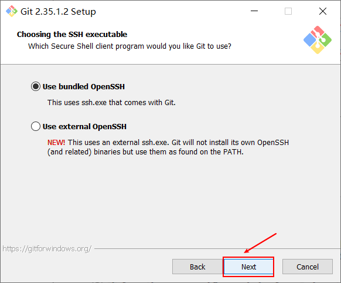

本教程只针对windows系统, mac系统的安装会在另一篇文章中展开说明

# 第一步: 去GIT下载官网去下载GIT安装包

下载地址:  https://git-scm.com/download/win

笔者已将安装包下载好, 担心自己下载有问题的可以在我们的公众号"数据臭皮匠" 回复 【git安装包】获取下载链接

# 第二部步: 开始安装GIT

双击安装包开始安装

## 2.1 Next

## 2.2 Next

## 2.3 Next

## 2.4 Next 

## 2.5 Next 

## 2.6 Next

## 2.7 Next 

## 2.8 Next 

## 2.9 Next 

## 2.10 Next 

## 2.11 Next

## 2.12 Next 

## 2.13 Next 

## 2.14 Next

## 2.15 Install 

## 2.16 耐心等待

## 2.17  Finish 

# 附录: 操作视频

