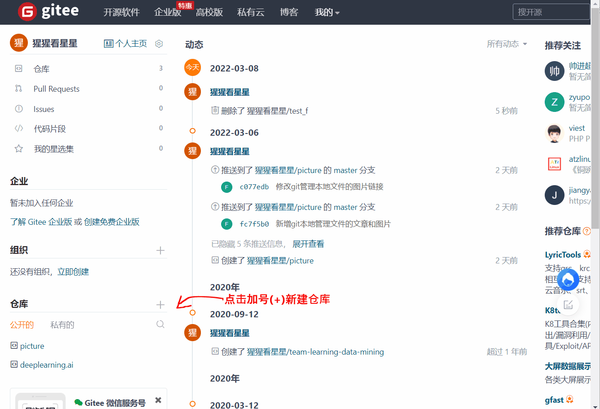
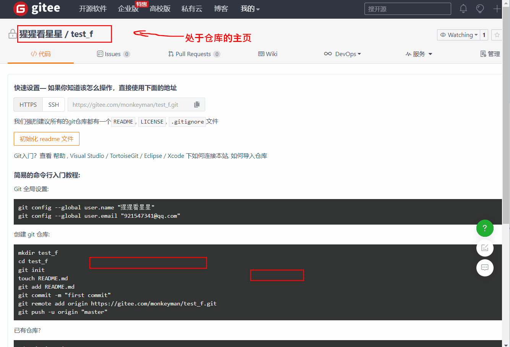
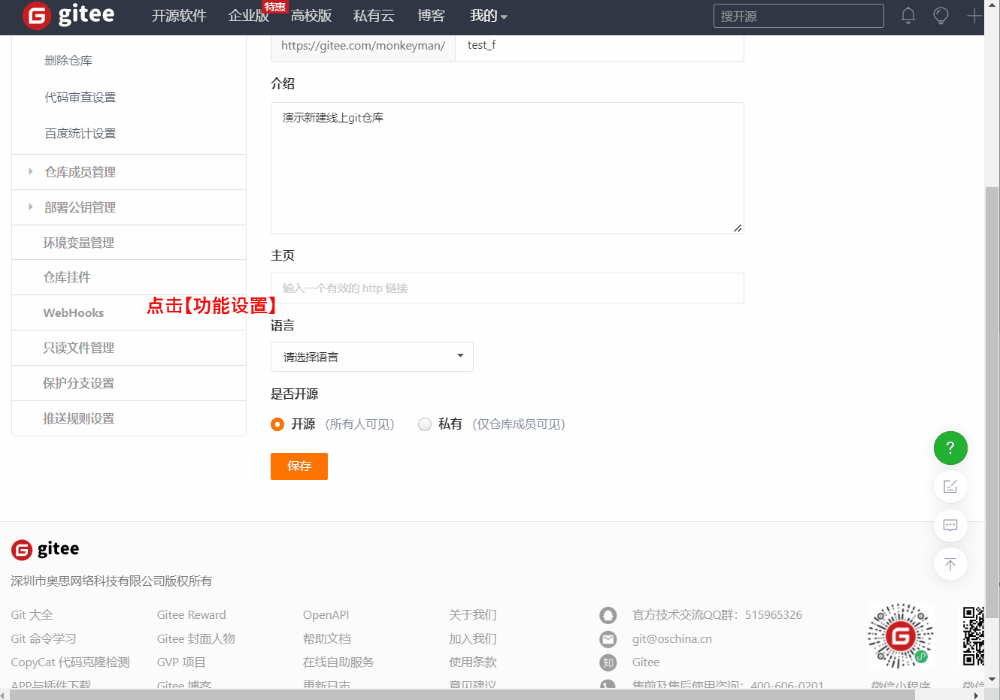
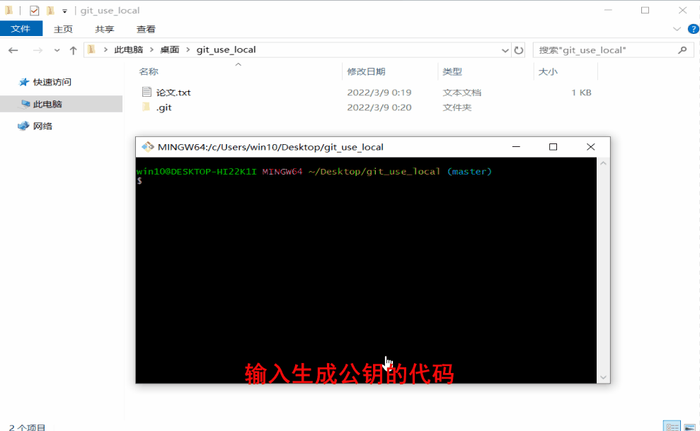
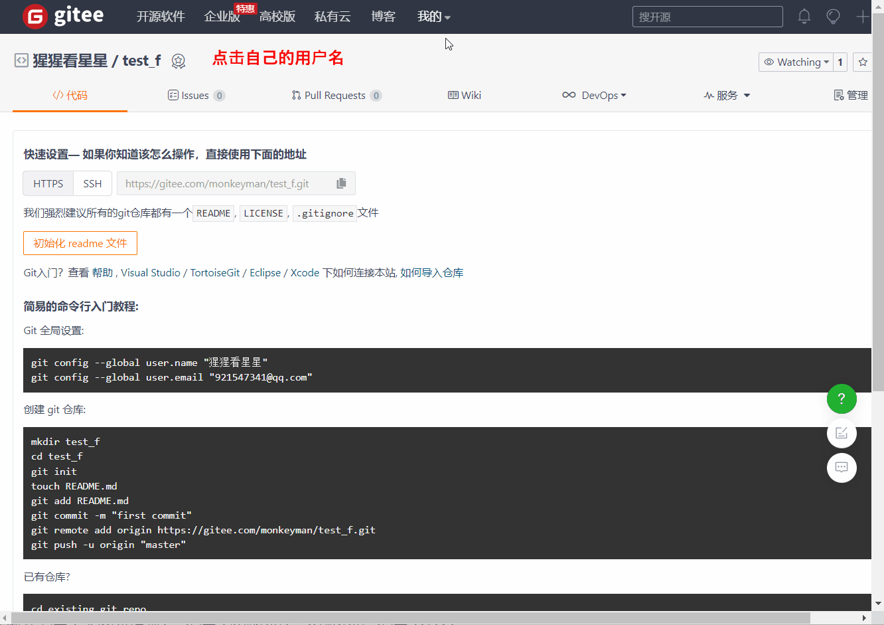
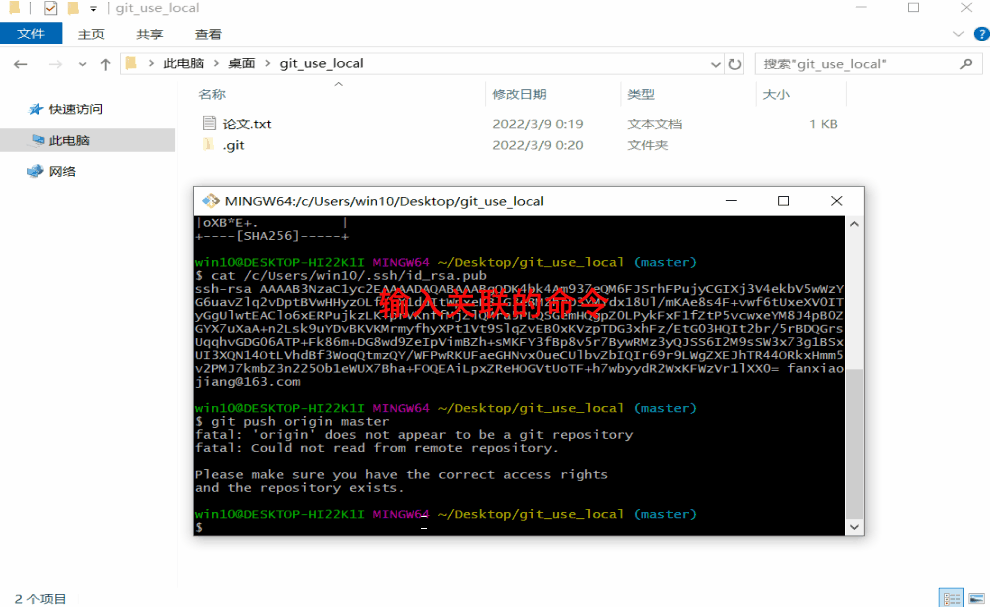
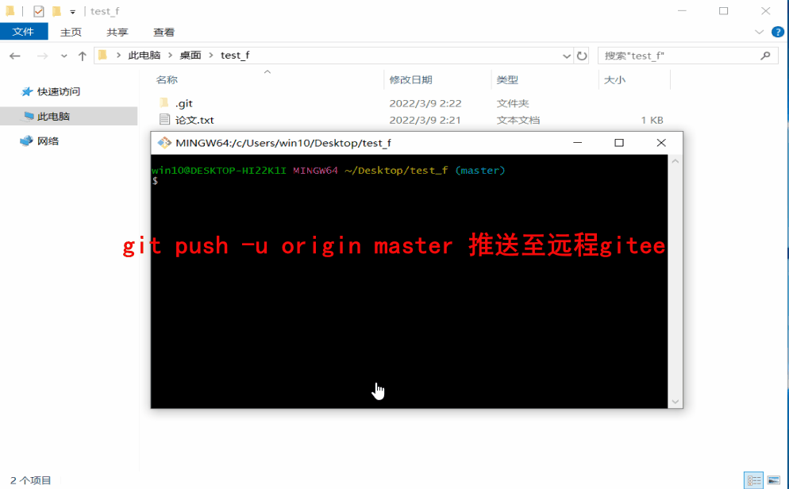
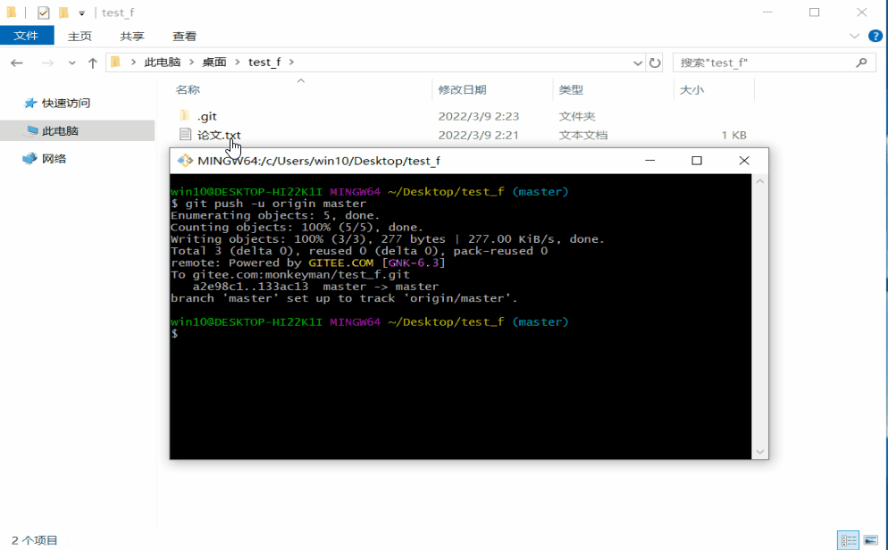

# 将本地的git仓库同步至线上git

[上篇文章]()介绍了如何使用7个常用命令管理本地的文件, 但仅仅限于本地的操作对于有更高最求的同学, 还是不够,本文将介绍通过一行命令将本地的git仓库同步至线上。

## 一、新建线上git仓库

这里接扫gitee的线上git，git本身是一个工具，提供线上git最出名的当然是github莫属，但github很多时候访问并不稳定，且英文界面可能对新接触git的同学造成不小门槛， 这里介绍国内访问速度快，且较大的平台[gitee](https://gitee.com/) 。

### 1. 新建git线上仓库

gitee的注册本身很简单， 这里就不再详细描述了， 直接从新建git仓库开始 

大致流程为：点击加号(+) 新建仓库 -->给仓库取个名字 -->写下仓库的简介 -->所有选项都保持默认-->点击【创建】-->创建成功

### 2.修改为开源库

新建的线上仓库默认是私有仓库， 对于用来保存资料的同学保持私有状态就可以，但是往往我们希望建立公开的git仓库， 这时后设置下仓库的属性就可以了

大致的流程为: 仓库主页点击【管理】-->点击【开源】-->保存

### 3.取消仓库文件在线编辑

大致步骤为: 点击【功能设置】-->取消【在线编辑】-->完成(系统会自动保存设置) 

## 二、将本地git仓库与线上git关联

### 1.生成公钥

大致步骤为: 输入生成公钥的命令 ssh-keygen -t rsa -C "fanxiaojiang@163.com"  --> 连续按三个回车(Enter)键 -->复制公钥文件地址 -->cat命令查看公钥值-->复制公钥值

### 2.将公钥配置到个人信息中

### 3.将本地仓库远程连接到gitee

只需要一行代码：git remote add origin git@gitee.com:username/repositroy ,username：是你的用户名，repository是你建的仓库 

比如说我的是： git remote add origin git@gitee.com:monkeyman/test_f.git

## 三、一行代码将本地仓库同步至线上

前面的配置走过一遍后， 只需要一行代码 git  push -u origin master 就可以将本地的仓库文件推送至远程gitee
也有可能是git  push -u origin main , master还是main需要取决于命令行的括号中的提示, 如本文图片中为master

后续本地的git仓库管理的文件再有更新的时候, push至远程就变得异常简单, 直接 git  push -u origin master 就OK 

## 四、总结

结合前面两篇文章[git安装](), [在本地应用git管理文件]()  , 7行命令入门git系列就已经结束了 , 如果读者按照本教程在自己使用git的过程中出现无法解决的问题,欢迎在我们的公众号留言, 我不一定及时但一定会回复 

在列下7+1行命令的清单 

| git命令                                 | 功能                                                         |
| --------------------------------------- | :----------------------------------------------------------- |
| git init                                | 在当前目录中初始化新的git仓库                                |
| git add .                               | 将新增的变化添加到缓存里                                     |
| git commit -m xxx                       | 将缓存区的内容提交到本地git仓库,并形成一个新的版本,  其中-m参数是mark的缩写,  表示注释, -m后面的xxx是注释内容,  版本的注释就是使用xxx表示, 版本注释很重要相当于版本的名字 |
| git log --oneline                       | 查看git的版本历史 其中--oneline是表示返回简略信息, 并且每个版本一行 如果不到--oneline参数会返回更详细的版本信息 不过笔者建议日常使用加上该参数 |
| git checkout xxx gitcheckout master | 将版本切换到指定的版本,其中xxx是版本id 版本id可以使用git log获取 需要切回最新版本的时候使用git checkout master |
| git status                              | 查看当前git的状态, 会返回待提交或者未add的修改内容           |
| git push -u origin master               | 将本地的更新推送到远程git仓库                                |

## 彩蛋

有同学可能对文章中gif是怎么录制的,这里介绍下工具,  是使用ScreenToGif录制的。这是款简单易上手的软件 , 安装包已经上传到gitee, 在我们的公众号回复【ScreenToGif】获取安装包地址